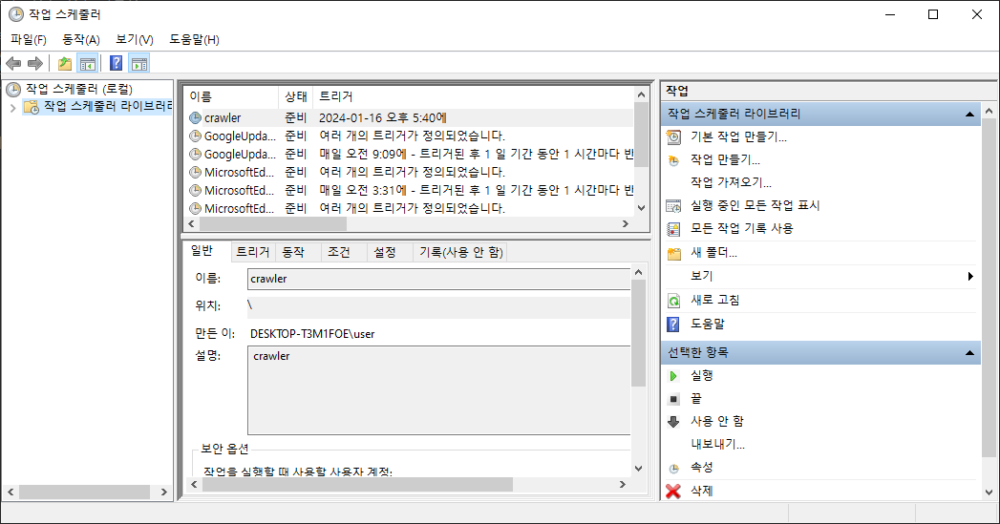
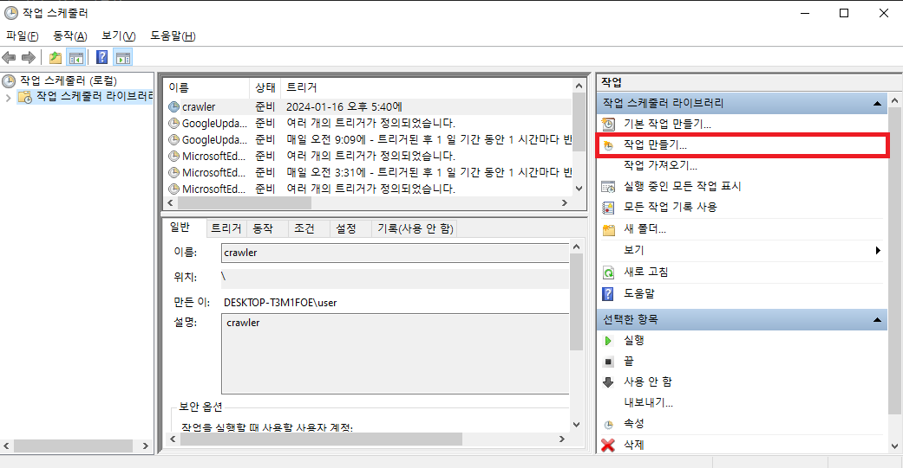
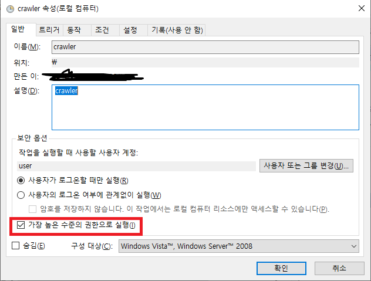
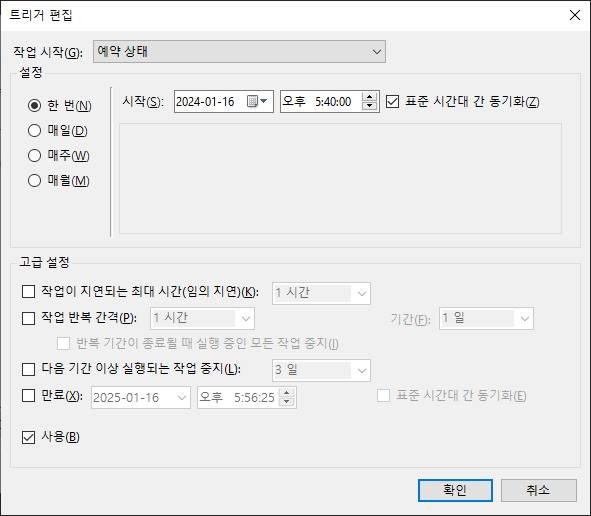
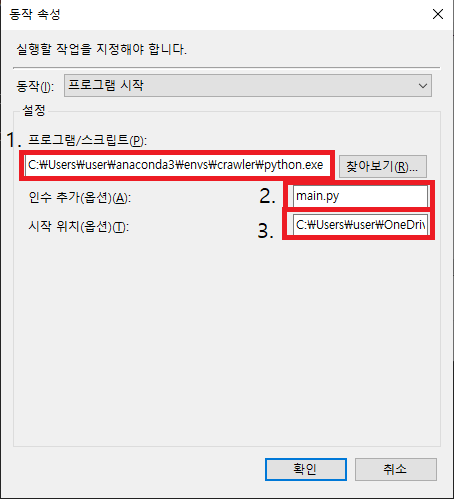
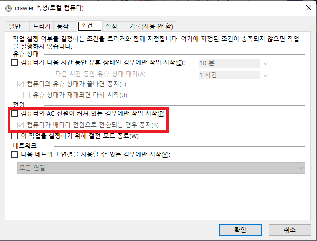

## Python Crawler Program ##
- 목적: 나라장터 사전규격 및 본 공고 정보 크롤링
- 코드 설명
    - crawler_prenotice_weekday.py : 매주 화요일 금요일에 나라장터 사전규격 공고 정보 크롤링 및 저장
    - crawler_postnotice_weekday.py : 매주 화요일 금요일에 나라장터 본 공고 정보 크롤링 및 저장
    - main.py : 위 두개 코드를 모두 실행하여 이메일을 발송하는 코드
    - 상세 내역은 코드내 주석 참조

- Window 스케줄러 등록 방법 및 관련 참조 링크
    - main.py를 윈도우 스케줄러에 등록하여 매주 자동으로 크롤링 결과를 이메일로 받고 있음
    - 작업스케줄러 실행
    
    - 작업 만들기 클릭
    
    - 가장 높은 수준의 권한으로 실행 체크 및 이름과 설명 추가
    
    - 트리거 탭내 새로만들기를 클릭하여 시작 시각에 대한 기준 설정
    
    - 파이썬 위치 및 실행 코드 위치 입력
        - 1. python cmd에서 where python 입력으로 경로 가져오기
        - 2. 실행파일 이름 입력하기
        - 3. 실행파일 위치 절대 경로로 입력하기
    
    - 노트북의 경우 충전중이 아닐때도 동작하도록 체크박스 해제
    